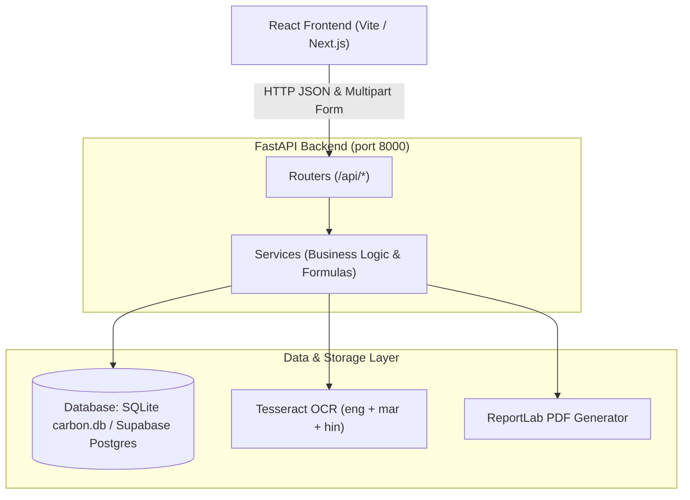

# Campus Carbon Footprint Auditor (UN SDG 13: Climate Action)

> A beginner-friendly, audit-ready backend REST API for monitoring, auditing, and reducing electrical and food carbon emissions across Indian college campuses.

---

## 1. Project Overview

This backend powers a green campus dashboard for Indian colleges. It processes electricity bills in regional languages (English, Marathi, Hindi), tracks monthly departmental emissions, calculates carbon intensity per student, benchmarks hostel mess meals, detects usage anomalies using statistical z-scores, models green energy savings, and generates one-click **NAAC Criterion 7 / NIRF** audit reports.

---

## 2. Core Features (9 Key Features)

1. **OCR Electricity Bill Scanner**: Upload PNG, JPG, or PDF bills to automatically extract consumption units (kWh), total amount (₹), and billing month.
2. **Multilingual Regional Support**: Reads bills printed in **English, Marathi (मराठी)**, and **Hindi (हिंदी)** (e.g., MSEDCL / Mahavitaran bills).
3. **Dual Rupee (₹) & Carbon Display**: Every emission metric is paired with its financial cost in Indian currency (₹) using Indian number grouping (e.g., ₹6,01,910).
4. **What-If Savings Simulator**: Interactive calculator simulating annual CO2 and ₹ savings for PC power-down policies, rooftop solar panels (with payback period), and LED retrofits.
5. **Fair Carbon League (Leaderboard)**: Ranks departments by emissions normalized per student (`CO2 / student`) so large departments are not unfairly penalized.
6. **Mess Plate Carbon Score**: Labels hostel meals (Low, Medium, High, Very High) with scientific carbon factors and calculates weekly CO2 savings for "Green Day" vegetarian pledges.
7. **One-Click NAAC/NIRF PDF Report**: Generates an official sustainability audit report formatted with executive summaries, 6-month historical trends, and official CEA citations.
8. **Statistical Anomaly Alert**: Detects unusual electricity spikes when a department's usage exceeds a z-score of 1.5 or is >30% above its 3-month rolling average.
9. **Solar Timing Advisor**: Recommends shifting energy-intensive campus loads (water pumps, server rooms, laundry) to peak solar hours (11 AM – 3 PM).

---

## 3. Tech Stack & Rationale

| Technology | Purpose | Why We Chose It |
| :--- | :--- | :--- |
| **Python 3.10+** | Programming Language | Clean, beginner-friendly syntax with rich scientific and image libraries. |
| **FastAPI** | Web Framework | High performance, automatic interactive OpenAPI/Swagger documentation at `/docs`, native synchronous route execution. |
| **Uvicorn** | ASGI Web Server | Lightweight, production-grade server for serving FastAPI endpoints. |
| **SQLite + SQLAlchemy** | Database & ORM | Zero-configuration single-file database (`carbon.db`) with seamless migration to Supabase PostgreSQL via `DATABASE_URL`. |
| **Pydantic** | Validation | Strict data validation and schema documentation for frontend developers. |
| **pytesseract + Pillow** | OCR & Image Processing | Open-source optical character recognition supporting English, Marathi, and Hindi bill formats. |
| **pdf2image** | PDF Conversion | Converts PDF bills into high-resolution images for OCR preprocessing. |
| **ReportLab** | PDF Generation | Creates programmatic, audit-grade NAAC sustainability reports. |

---

## 4. Architecture Diagram



---

## 5. Folder Structure

```
backend/
├── main.py                  # App entry point, CORS config, database startup, router registration
├── database.py              # SQLite engine, Supabase PostgreSQL switch, and get_db() session helper
├── models.py                # SQLAlchemy database tables: Department, MonthlyUsage, Bill, MessMeal
├── schemas.py               # Pydantic schemas for request validation and response typing
├── config.py                # All constants, CEA emission factors, tariffs, and thresholds
├── seed.py                  # Resets and populates the database with 6 months of data and mess meals
├── requirements.txt         # Required Python packages
├── README.md                # Complete documentation, setup guide, and API reference
│
├── routers/                 # Clean API endpoint definitions
│   ├── __init__.py
│   ├── bills.py             # Bill OCR upload, verification, and saved bill retrieval
│   ├── overview.py          # Campus overview totals, 6-month trends, and department dropdown
│   ├── whatif.py            # What-If energy and financial savings simulator
│   ├── leaderboard.py       # Carbon League leaderboard sorted per student or total
│   ├── mess.py              # Hostel mess meals, plate carbon labels, and Green Day voting
│   ├── reports.py           # One-click downloadable NAAC/NIRF PDF report
│   ├── anomalies.py         # Statistical anomaly alerts for departmental energy spikes
│   └── tips.py              # Solar timing tips for heavy campus equipment
│
├── services/                # Calculation logic and external processing (no API logic)
│   ├── __init__.py
│   ├── carbon_service.py    # CEA CO2 calculations and Indian Rupee (₹) formatting
│   ├── ocr_service.py       # Image enhancement, OCR extraction, and regex parsers
│   ├── whatif_service.py    # Formulas for PC power-down, solar payback, and LED retrofits
│   ├── anomaly_service.py   # Statistical mean, standard deviation, and z-score calculations
│   └── report_service.py    # ReportLab document construction for NAAC reports
│
├── data/
│   ├── monthly_usage_history.csv   # 6 months of departmental electricity records (48 rows)
│   └── sample_bills/               # Demo electricity bills for testing OCR
│
├── uploads/                 # Storage directory for uploaded electricity bills
└── reports/                 # Storage directory for generated NAAC PDF reports
```

---

## 6. Setup & Installation

### Step 1: System Prerequisites
1. **Python 3.10+** installed on your system.
2. **Tesseract OCR**:
   - **Windows**: Download installer from [UB-Mannheim Tesseract](https://github.com/UB-Mannheim/tesseract/wiki). During installation, check the boxes for **Marathi** (`mar`) and **Hindi** (`hin`) script files.
   - **Linux/Ubuntu**: `sudo apt install tesseract-ocr tesseract-ocr-mar tesseract-ocr-hin poppler-utils`
   - **macOS**: `brew install tesseract tesseract-lang poppler`

### Step 2: Install Python Dependencies
```bash
cd backend
pip install -r requirements.txt
```

### Step 3: Seed Database
```bash
python seed.py
```
*Expected output: Added 8 departments, Added 48 usage rows, Added 14 meals.*

### Step 4: Start the Server
```bash
uvicorn main:app --reload --host 0.0.0.0 --port 8000
```
Open **[http://localhost:8000/docs](http://localhost:8000/docs)** to test the interactive Swagger documentation.

---

## 7. Connecting to Supabase Database (Optional)

The application automatically uses local `carbon.db` (SQLite) by default. To connect to a **Supabase PostgreSQL** database:
1. Copy your Supabase URI from your Supabase Project Settings -> Database -> Connection String (URI).
2. Set the `DATABASE_URL` environment variable:
   ```bash
   # Windows PowerShell
   $env:DATABASE_URL="postgresql://postgres:[YOUR-PASSWORD]@[YOUR-HOST].supabase.co:5432/postgres"

   # Linux/macOS
   export DATABASE_URL="postgresql://postgres:[YOUR-PASSWORD]@[YOUR-HOST].supabase.co:5432/postgres"
   ```
3. Run `python seed.py` to create tables and seed demo data directly into Supabase!

---

## 8. API Endpoint Reference

All API routes are prefixed with `/api`.

| Method | Endpoint | Description | Sample Output / Query Params |
| :--- | :--- | :--- | :--- |
| `GET` | `/` | API status check | `{"message": "Campus Carbon Auditor API is running..."}` |
| `POST` | `/api/bills/scan` | Uploads bill image/PDF, returns extracted values & preview CO2 | Multipart file (field name: `file`) |
| `POST` | `/api/bills/confirm` | Saves verified bill values into database | JSON body with `department_id`, `units_kwh`, `amount_inr` |
| `GET` | `/api/bills` | Retrieves list of all confirmed bills | List of bills with CO2 and ₹ values |
| `GET` | `/api/overview` | Campus totals, 6-month trend, and previous month comparison | `?month=2026-10` |
| `GET` | `/api/departments` | List of departments for frontend dropdown | `[{"id": 1, "name": "Computer", "students": 480}]` |
| `POST` | `/api/whatif` | Simulates monthly & annual savings for solar, PCs, and LEDs | JSON body with simulator inputs |
| `GET` | `/api/leaderboard` | Carbon League rankings (sorted by per-student CO2) | `?month=2026-10&mode=per_student` |
| `GET` | `/api/mess` | Weekly mess menu with plate carbon scores & Green Day tip | Grouped by Monday–Sunday |
| `POST` | `/api/mess/{id}/vote`| Votes for a meal pledge on Green Day | Increments vote counter |
| `GET` | `/api/reports/naac` | Downloads official NAAC Criterion 7 audit report PDF | `?month=2026-10` (returns binary PDF) |
| `GET` | `/api/anomalies` | Statistical z-score anomaly alerts for energy spikes | `?month=2026-10` |
| `GET` | `/api/tips/solar` | Solar timing guidance for campus heavy equipment | Schedule tips for 11 AM – 3 PM window |

---

## 9. Formulas & Mathematical Principles

### 1. Carbon Footprint (Electricity)
$$\text{CO}_2\ (\text{kg}) = \text{Units Consumed (kWh)} \times 0.71\ \text{kg CO}_2/\text{kWh}$$
*Factor: 0.71 kg/kWh (Central Electricity Authority Baseline Database).*

### 2. Electricity Expenditure
$$\text{Cost (₹)} = \text{Units Consumed (kWh)} \times ₹11.50/\text{kWh}$$

### 3. Fair Department Carbon Intensity
$$\text{CO}_2\ \text{per student (kg)} = \frac{\text{Department Total CO}_2\ (\text{kg})}{\text{Enrolled Students}}$$

### 4. What-If PC Savings
$$\text{kWh/month} = \frac{\text{PCs} \times \text{Watts} \times \text{Hours Saved/day} \times \text{Working Days}}{1000}$$

### 5. Rooftop Solar Payback Duration
$$\text{Annual Generation (kWh)} = \text{kW Capacity} \times 4\ \text{units/day} \times 365\ \text{days}$$
$$\text{Payback Period (years)} = \frac{\text{Solar kW} \times ₹50,000}{\text{Annual ₹ Saved}}$$

### 6. Statistical Anomaly Detection (Z-Score)
For a department in month $t$, using historical consumption $X = [x_{t-1}, x_{t-2}, x_{t-3}]$:
$$\mu = \text{mean}(X),\quad \sigma = \text{standard\_deviation}(X)$$
$$z = \frac{x_t - \mu}{\sigma},\quad \Delta\% = \frac{x_t - \mu}{\mu} \times 100$$
*Flagged as an anomaly if $z > 1.5$ OR $\Delta\% > 30\%$.*

---

## 10. Official Data Sources

1. **Electricity Emission Factor**: Central Electricity Authority (CEA), Ministry of Power, Government of India. *CO2 Baseline Database for the Indian Power Sector*.
2. **Food Emission Benchmarks**: Poore, J., & Nemecek, T. (2018). *Reducing food's environmental impacts through producers and consumers*. Science, 360(6392), 987-992.
3. **NAAC Alignment**: Aligned with NAAC Criterion 7: *Institutional Values and Best Practices (Environmental Consciousness and Sustainability)*.
